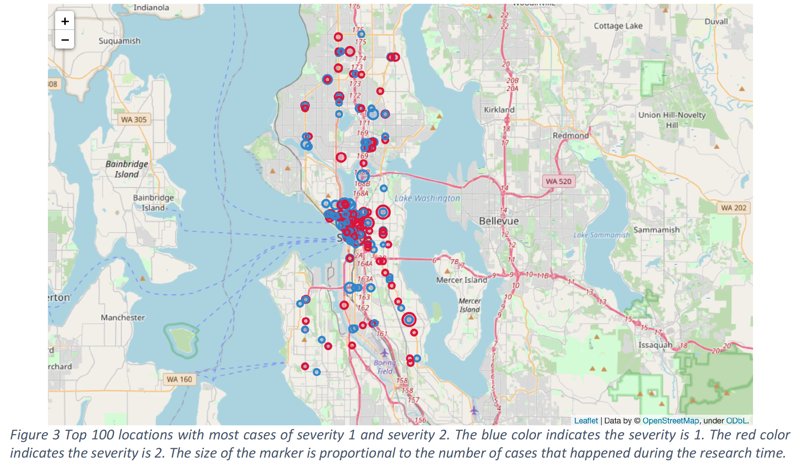

# Prediction of Accidents' Severity Based on Collisions
## Visualization

## Abstract
The automobile has become an important part of daily life. It influences how we live, work, and how we spend our time. It helps you to go to the workplace on time, sends your kids to school, and takes you and your family on a vacation on a beach. However, at the same time that it brings happiness, it also brings danger – car accidents. According to the statistics, there are 16,438 cars. crashes per day in the U.S. alone. On a global scale, there is approximately 3287 death every day due to car accidents. Generally, people would try not to drive at rush hour, bad weather, or dark place to avoid the chance to get into an accident. However, sometimes driving in a bad condition is unavoidable. For example, your kids are waiting for you to pick them back home after the piano class on a snowy night. This raises the question that how we maintain our daily needs and avoid accidents and related injuries at the same time. Thus, it is necessary to provide a model to predict the severity of an accident, thus one could estimate the dangers of different driving behaviors and stay safe.

Herein, we would build a machine learning model based on collision data to predict the accident severity. Data is provided by SPD and recorded by Traffic Records downloaded from the IBM course on Coursera. The provided dataset will be cleaned, processed, and used to build a classification model to predict whether an accident will lead to property damage or injury.
